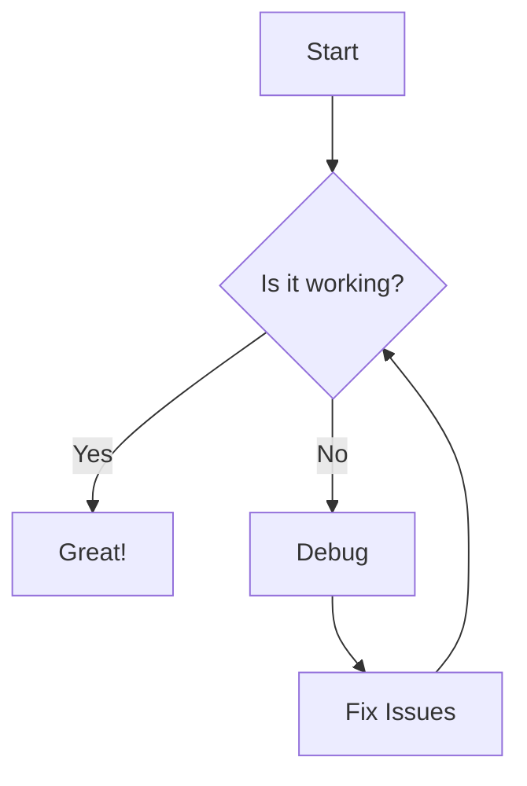

# Welcome to My Blog! 🎉

This is my first post using Jekyll with the Chirpy theme. I'm excited to share my thoughts and experiences here.

## What is Jekyll?

Jekyll is a static site generator that transforms your plain text into static websites and blogs. It's perfect for:

- **Fast loading** - No database queries or server-side processing
- **Secure** - No dynamic content means fewer security vulnerabilities
- **Version control friendly** - Everything is stored as files
- **Free hosting** - Works great with GitHub Pages

## Getting Started with Chirpy

The Chirpy theme provides a beautiful, responsive design with many features:

### Key Features
- 🌙 Dark/Light mode toggle
- 📱 Mobile responsive design
- 🏷️ Tag and category support
- 💬 Comment system integration
- 🔍 Search functionality
- 📊 Table of contents generation

### Basic Post Structure

Every Jekyll post starts with front matter (the YAML section at the top of this file). Here's what each field does:

```yaml
---
title: Your Post Title
date: 2024-11-02 15:30:00 +0800
categories: [Category1, Category2]
tags: [tag1, tag2, tag3]
author: Your Name
description: Brief description of your post
image:
  path: /assets/img/your-image.jpg
  alt: Image description for accessibility
---
```

## Writing Content

### Text Formatting

You can use standard Markdown formatting:

**Bold text** with `**double asterisks**`

*Italic text* with `*single asterisks*`

~~Strikethrough~~ with `~~double tildes~~`

### Code Blocks

Inline code: `console.log('Hello World')`

Block code with syntax highlighting:

```javascript
function greetUser(name) {
  console.log(`Hello, ${name}!`);
  return `Welcome to my blog, ${name}`;
}

greetUser('Reader');
```

### Lists

#### Unordered Lists
- First item
- Second item
  - Nested item
  - Another nested item
- Third item

#### Ordered Lists
1. First step
2. Second step
3. Third step

### Links and Images

[Link to Jekyll](https://jekyllrb.com/)


### Blockquotes

> This is a blockquote. It's great for highlighting important information or quotes from other sources.
>
> You can have multiple paragraphs in a blockquote.

### Tables

| Feature | Jekyll | WordPress |
|---------|--------|-----------|
| Speed | ⚡ Fast | 🐌 Slower |
| Security | 🔒 High | ⚠️ Medium |
| Hosting | 🆓 Free | 💰 Paid |
| Learning | 📈 Steep | 📉 Easy |

## Mathematical Expressions

Chirpy supports MathJax for mathematical expressions:

Inline math: $E = mc^2$

Block math:
$$
\sum_{i=1}^{n} x_i = x_1 + x_2 + \cdots + x_n
$$

## Mermaid Diagrams



## Tips for Great Blog Posts

1. **Write compelling titles** - Make readers want to click
2. **Use headings** - Break up content for easy scanning
3. **Include images** - Visual content increases engagement
4. **Add code examples** - Show, don't just tell
5. **Proofread** - Check for typos and clarity
6. **Be consistent** - Regular posting builds audience

## What's Next?

I'm planning to write about:
- [ ] Web development tutorials
- [ ] Programming best practices
- [ ] Technology reviews
- [ ] Personal projects and experiences

---

*Thanks for reading my first post! Feel free to leave comments or questions below.*